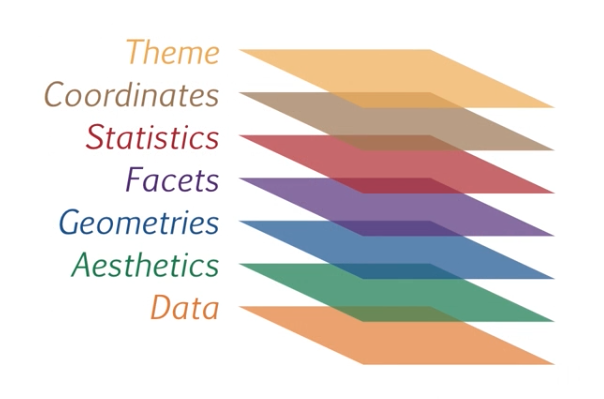
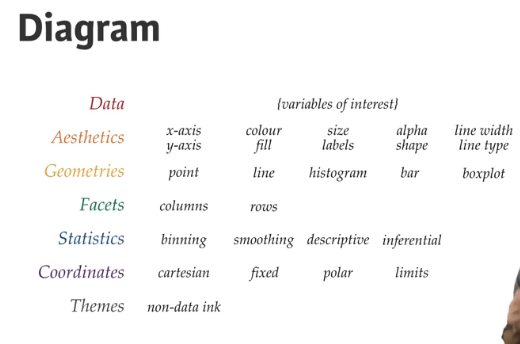

# GGPlot2 in the Batcave

GGPlot2 is a data visualization library created by Hadley Wickham. At its core it contains:

* Data - dataset being plotted.
* Aesthetics - scales onto which we map our data.
* Geometries - The visual elements used for our data.
* Facets - Plotting small multiples.
* Statistics - Representations of our data to aid understanding.
* Coordinates - The space on which the data will be plotted.
* Themes - All non-data ink.




## Getting started
```{r}
library(ggplot2)
ggplot(mtcars, aes(x = cyl, y = mpg)) + geom_point() # a very simple plot
ggplot(diamonds, aes(x = carat, y = price, col=clarity)) + geom_point(alpha=0.4)
```

## Recycle your plots
```{r}
p <- ggplot(iris, aes(x=Petal.Width, y=Petal.Length))
p+geom_point()
p+geom_jitter()
p+coord_polar()

p <- ggplot(dbase)

```